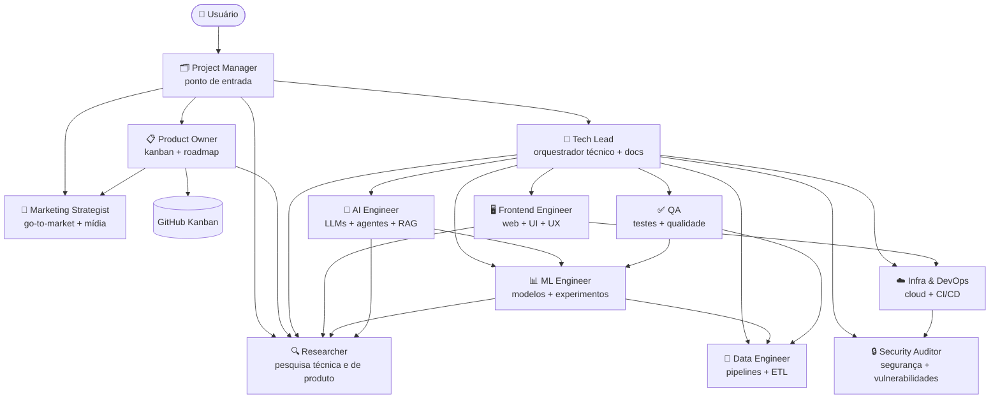

# Claude Code Kanban Template

Template base para criar novos projetos Python com Claude Code configurado, equipe multi-agentes e kanban no GitHub Projects.

**Este repositório é uma fábrica de projetos** — você usa o `/wizard` aqui para criar um novo repositório filho já configurado. O desenvolvimento acontece no filho, não aqui.

---

## O que o filho recebe ao ser criado

| Entregável | Detalhe |
|---|---|
| **12 agentes especializados** | `project-manager`, `tech-lead`, `product-owner`, `data-engineer`, `ml-engineer`, `ai-engineer`, `infra-devops`, `qa`, `researcher`, `security-auditor`, `frontend-engineer`, `marketing-strategist` — com organograma, cadeia de comando e protocolo de escalation |
| **Kanban pré-populado** | Épicos template em 6 dimensões: Discovery, Negócio, Produto, Tech, Lançamento, Operações |
| **`/kickoff`** | Inicia o projeto: discovery → pesquisa (`researcher`) → relatório + apresentação (PM) → backlog completo (PO) → aprovação → delegação |
| **`/advance`** | Avança no Kanban: fecha prontos (PO), valida issues com PO, paraleliza issues independentes, delega via TL |
| **`/review-backlog`** | Varredura proativa: fecha prontos, identifica lacunas, refina e cria novas issues (PO + TL) |
| **`/review`, `/deploy`, `/fix-issue`** | Code review, deploy e correção de bugs |
| **CI/CD** | GitHub Actions com ruff, black e pytest em todo PR |
| **`CLAUDE.md` e `AGENTS.md`** | Gerados com o nome do projeto, com regras de persona, kanban e delegação |
| **Permissões granulares** | Agentes operam sem prompts desnecessários; operações destrutivas bloqueadas |

---

## Arquitetura Multi-Agentes



---

## Como criar um novo projeto

### Via wizard (recomendado)

Em uma conversa nova **neste repositório**, use:

```
/wizard
```

O wizard vai:
1. Perguntar nome, visibilidade e se instalar skills Caveman
2. Verificar se a pasta local já existe
3. Criar o repositório no GitHub a partir deste template
4. Clonar localmente
5. Configurar o secret `GH_PAT` (PAT com escopo: `repo`, `project`, `read:org`)
6. Disparar a workflow `Setup Kanban` — cria o board e os épicos template
7. Remover arquivos exclusivos do template (wizard, scripts de criação, etc.)
8. Gerar `CLAUDE.md` e `AGENTS.md` específicos do projeto filho

Após a criação, abra o projeto filho em uma nova conversa e rode `/kickoff`.

### Via script direto

```bash
python scripts/new_repo.py --name <nome> --visibility private --yes
```

Flags úteis:
- `--yes` — confirma tudo sem prompts
- `--skip-clone` — cria apenas no GitHub sem pasta local
- `--caveman` / `--skip-caveman` — instala ou pula as skills Caveman

### Via GitHub (manual)

1. Clique em **Use this template** no GitHub
2. Adicione o secret `GH_PAT` no repositório novo
3. Rode a workflow `Setup Kanban` manualmente
4. Clone localmente e abra no Claude Code

---

## Estrutura deste template

```text
.claude/
  agents/                    # definições dos 12 agentes
  commands/
    wizard.md                # /wizard — exclusivo do pai
    review.md                # /review — herdado pelo filho
    deploy.md                # /deploy — herdado pelo filho
    fix-issue.md             # /fix-issue — herdado pelo filho
    clean.md                 # /clean — herdado pelo filho
    sync-to-projects.md      # /sync-to-projects — propaga template → filhos (exclusivo do pai)
    sync-to-template.md     # /sync-to-template — propaga filho → template (exclusivo do pai)
  settings.json              # permissões e operações bloqueadas
scripts/
  new_repo.py                # lógica do wizard
  templates/
    CLAUDE.md                # gerado no filho com regras de project-manager e commands
    AGENTS.md                # gerado no filho com equipe e fluxos
    README.md                # gerado no filho com overview do projeto
    commands/
      kickoff.md             # copiado para .claude/commands/ do filho
      advance.md             # copiado para .claude/commands/ do filho
      review-backlog.md      # copiado para .claude/commands/ do filho
.github/
  workflows/
    setup-kanban.yml         # cria Kanban e épicos no projeto filho
    ci.yml                   # CI: ruff, black, pytest
src/
tests/
notebooks/
pyproject.toml
CLAUDE.md                    # instrui o Claude Code quando opera neste template
CLAUDE.local.md.example
.mcp.json.example
.gitignore
AGENTS.md
```

---

## Ferramentas disponíveis nos projetos filho

| Ferramenta | Cobertura |
|---|---|
| `Bash(git:*)` | Todos os comandos git (exceto force push e reset hard) |
| `Bash(gh:*)` | gh CLI — issues, PRs, projects, workflows (exceto operações destrutivas) |
| `Bash(python/pytest/ruff/black/pip/uv:*)` | Desenvolvimento Python completo |
| `WebSearch` / `WebFetch` | Pesquisa web e leitura de URLs |
| MCP GitHub | Leitura e escrita de issues, PRs, branches, reviews |

Operações permanentemente bloqueadas: `git push --force`, `git reset --hard`, `git clean -f`, `gh repo delete`, `gh secret set/delete`, `gh auth login/token`, `gh ssh-key add`.

---

## Observações

- No primeiro push do repo filho, a workflow pode rodar antes de `GH_PAT` existir — ela cria labels e issue inicial mas pula o board. Configure o secret e rode `Setup Kanban` manualmente.
- A view `Board` é criada via API, mas o agrupamento visual por `Status` pode precisar de ajuste manual na interface do GitHub.
- Para projetos com Docker, Terraform, npm ou conda, adicione as permissões no `settings.json` do filho — não estão no template por serem projeto-específicas.
