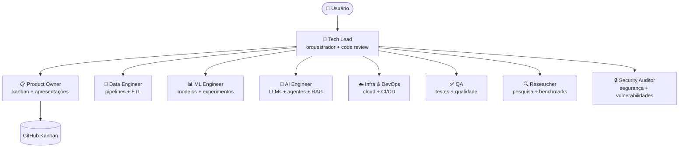

# Claude Code Kanban Template

Template base para novos projetos Python com Claude Code configurado e kanban no GitHub Projects.

## Arquitetura Multi-Agentes



## O que esta incluido

```text
.claude/
  agents/
    tech-lead.md
    product-owner.md
    data-engineer.md
    ml-engineer.md
    ai-engineer.md
    infra-devops.md
    qa.md
    researcher.md
    security-auditor.md
  commands/
    review.md
    deploy.md
    fix-issue.md
  settings.json
.github/
  workflows/
    setup-kanban.yml
scripts/
  verify.sh
  new_repo.py
src/
tests/
notebooks/
pyproject.toml
CLAUDE.md
CLAUDE.local.md.example
.mcp.json.example
.gitignore
AGENTS.md
```

## Wizard

Se este folder for usado para criar um novo repositorio a partir do template, o caminho recomendado agora e o wizard:

```bash
python scripts/new_repo.py
```

Ele ajuda a:
- escolher nome do repositorio
- definir visibilidade publica/privada
- clonar o repositorio novo localmente por padrao
- configurar `GH_PAT`
- disparar a workflow `Setup Kanban`
- validar o resultado final

Em uma conversa nova neste projeto, voce tambem pode simplesmente dizer:

```text
iniciar
```

e o agente deve preferir esse wizard como fluxo padrao.
Quando automatizar esse passo, deve usar `--yes` para evitar prompts finais em modo nao interativo.
Se quiser criar apenas no GitHub sem pasta local, use `--skip-clone`.

## Como usar manualmente

1. Clique em **Use this template** no GitHub e crie um novo repositorio.
2. Adicione o secret `GH_PAT` no repositorio novo.
3. Rode a workflow `Setup Kanban`.
4. Valide:
   - existe um project com nome `<repo> Kanban`
   - o project aparece na aba `Projects` do repositorio
   - existem as views `Board`, `Table` e `Done`
   - a issue `Getting Started` existe
   - a issue `Getting Started` esta no project com status `Todo`

## Observacoes

- No primeiro push do repo criado a partir do template, a workflow pode rodar antes de `GH_PAT` existir.
- Nessa situacao, a workflow nao deve falhar; ela cria labels e issue inicial e pula a criacao do project.
- Depois que `GH_PAT` for configurado, rode `Setup Kanban` manualmente.
- A API atual do GitHub permite criar a view `Board`, mas o agrupamento visual por `Status` ainda pode exigir ajuste manual na interface.

## Slash Commands

| Comando | O que faz |
|---|---|
| `/project:review` | Dispara `code-reviewer` e `security-auditor` em paralelo e consolida um relatorio unico |
| `/project:fix-issue` | Identifica causa raiz e aplica correcao minima |
| `/project:deploy` | Checklist de deploy |

## CI

Todo PR roda automaticamente:
- `ruff check`
- `black --check`
- `pytest`

## Arquivos locais

| Arquivo | Proposito |
|---|---|
| `.mcp.json` | Configuracao local dos MCP servers |
| `CLAUDE.local.md` | Preferencias pessoais locais |
| `.claude/settings.local.json` | Overrides locais de permissoes |
