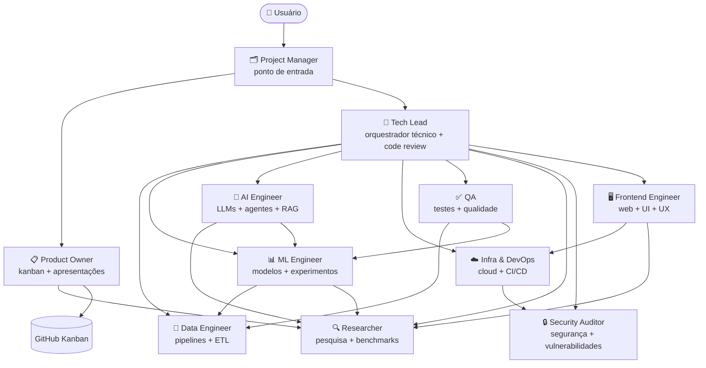

# Claude Code Kanban Template

Template base para novos projetos Python com Claude Code configurado, equipe multi-agentes e kanban no GitHub Projects.

## Arquitetura Multi-Agentes



## O que esta incluido

```text
.claude/
  agents/
    project-manager.md      # ponto de entrada, delega para PO ou tech-lead
    tech-lead.md            # orquestrador técnico + code review
    product-owner.md        # kanban + apresentações
    data-engineer.md        # pipelines + ETL
    ml-engineer.md          # modelos + experimentos
    ai-engineer.md          # LLMs + agentes + RAG
    infra-devops.md         # cloud + CI/CD
    qa.md                   # testes + qualidade
    researcher.md           # pesquisa + benchmarks
    security-auditor.md     # segurança + vulnerabilidades
    frontend-engineer.md    # web + UI + UX
  commands/
    review.md
    deploy.md
    fix-issue.md
  settings.json
.agents/
  skills/
    project-kickoff/        # fluxo de entrada de novas demandas
    code-review/            # padrão de revisão de código
    backlog-management/     # gestão de issues e kanban
    data-pipeline/          # padrão de pipelines ETL
    ml-experiment/          # condução de experimentos de ML
    llm-integration/        # integração de LLMs e agentes
    ci-cd-setup/            # configuração de CI/CD
    testing-patterns/       # padrões de teste com pytest
    research-report/        # estrutura de relatórios de pesquisa
    security-review/        # checklist de segurança
    frontend-patterns/      # padrões de desenvolvimento frontend
    caveman/                # opcional: modo ultra-comprimido de tokens (~75% menos)
    caveman-commit/         # opcional: mensagens de commit comprimidas
    caveman-review/         # opcional: code review em uma linha por finding
.github/
  workflows/
    setup-kanban.yml
scripts/
  new_repo.py
src/
tests/
notebooks/
pyproject.toml
CLAUDE.md
CLAUDE.local.md.example
.mcp.json.example
.gitignore
AGENTS.md
```

## Regras de Processo

### Kanban
O kanban é a fonte de verdade. Todos os agentes consultam antes de agir.

| Papel | Agente | Permissões |
|---|---|---|
| Dono | `product-owner` | cria, fecha, move qualquer card |
| Leitor obrigatório | `project-manager` | lê antes de toda delegação |
| Atualizador | especialistas | move o próprio card para `In Progress` e `In Review` |
| Fechador | `product-owner` + `tech-lead` | movem para `Done` após aprovação |

### Código e PRs

| Etapa | Responsável |
|---|---|
| Escrever código | agente especialista |
| Abrir PR | agente especialista que implementou |
| Code review | `tech-lead` — sempre |
| Security review | `security-auditor` — PRs com infra, auth ou dados sensíveis |
| QA review | `qa` — valida cobertura de testes |
| Aprovar e fazer merge | `tech-lead`; `infra-devops` em PRs de CI/CD quando delegado |
| Fechar issue | `product-owner` após merge |

## Wizard

Se este folder for usado para criar um novo repositorio a partir do template, o caminho recomendado e o wizard:

```bash
python scripts/new_repo.py
```

Ou use `/wizard` em uma conversa nova neste projeto.

O wizard ajuda a:
- escolher nome e visibilidade do repositorio
- clonar o repositorio novo localmente
- configurar `GH_PAT` (use um PAT dedicado com escopo mínimo: `repo`, `project`, `read:org`)
- disparar a workflow `Setup Kanban`
- instalar opcionalmente os skills Caveman (modo comprimido de tokens)
- validar o resultado final

Flags uteis:
- `--yes` — confirma tudo sem prompts (modo nao interativo)
- `--skip-clone` — cria apenas no GitHub sem pasta local
- `--caveman` / `--skip-caveman` — instala ou pula os skills Caveman

## Como usar manualmente

1. Clique em **Use this template** no GitHub e crie um novo repositorio.
2. Adicione o secret `GH_PAT` no repositorio novo.
3. Rode a workflow `Setup Kanban`.
4. Valide:
   - existe um project com nome `<repo> Kanban`
   - o project aparece na aba `Projects` do repositorio
   - existem as views `Board`, `Table` e `Done`
   - a issue `Getting Started` existe e esta no project com status `Todo`

## Observacoes

- No primeiro push do repo criado a partir do template, a workflow pode rodar antes de `GH_PAT` existir.
- Nessa situacao, a workflow nao deve falhar; ela cria labels e issue inicial e pula a criacao do project.
- Depois que `GH_PAT` for configurado, rode `Setup Kanban` manualmente.
- A API atual do GitHub permite criar a view `Board`, mas o agrupamento visual por `Status` ainda pode exigir ajuste manual na interface.

## Slash Commands

| Comando | O que faz |
|---|---|
| `/project:review` | Dispara `tech-lead` e `security-auditor` em paralelo e consolida um relatorio unico |
| `/project:fix-issue` | Identifica causa raiz e aplica correcao minima |
| `/project:deploy` | Checklist de deploy |

## CI

Todo PR roda automaticamente:
- `ruff check`
- `black --check`
- `pytest`

## Arquivos locais

| Arquivo | Proposito |
|---|---|
| `.mcp.json` | Configuracao local dos MCP servers |
| `CLAUDE.local.md` | Preferencias pessoais locais |
| `.claude/settings.local.json` | Overrides locais de permissoes |
