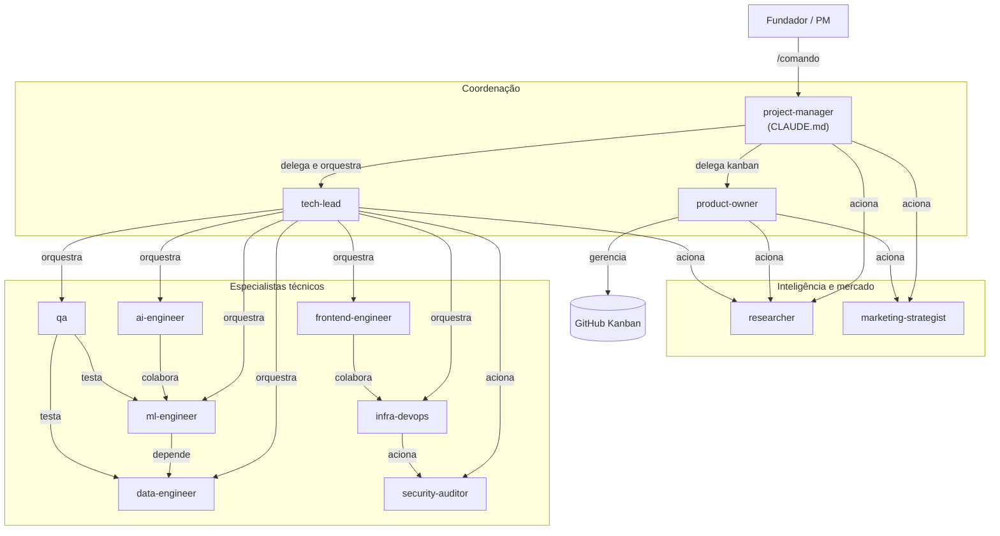

# Organograma e cadeia de comando

Quem responde a quem, quem pode delegar para quem, e quem tem a palavra final em cada tipo de decisão.

---

## Organograma completo



---

## Cadeia de comando por tipo de decisão

### Decisões de produto

```
Fundador
    ↓ (define a direção)
project-manager
    ↓ (consolida e prioriza)
product-owner
    ↓ (executa no Kanban)
```

### Decisões técnicas

```
Agente especialista
    ↓ (abre PR)
tech-lead
    ↓ (aprova e mergia)
project-manager
    ↓ (fecha issue no Kanban via PO)
```

### Decisões de segurança

```
infra-devops ou qualquer agente que detectar risco
    ↓ (aciona)
security-auditor
    ↓ (relatório de vulnerabilidade)
tech-lead
    ↓ (prioriza correção)
project-manager
```

---

## Permissões no Kanban

| Ação | Quem pode fazer |
|---|---|
| Criar issue | `project-manager`, `product-owner` |
| Mover para In Progress | o especialista da tarefa |
| Mover para In Review | o especialista da tarefa |
| Mover para Done | `product-owner` (após aprovação do TL) |
| Fechar issue | `product-owner` |
| Sugerir nova issue | qualquer especialista (no relatório de entrega) |

---

## Regras de delegação

| De | Para | Condição |
|---|---|---|
| `project-manager` | `tech-lead` | trabalho técnico |
| `project-manager` | `product-owner` | kanban, backlog, priorização |
| `project-manager` | `researcher` | intelligence de mercado ou técnica |
| `project-manager` | `marketing-strategist` | GTM, posicionamento, campanhas |
| `tech-lead` | especialistas técnicos | qualquer trabalho de engenharia |
| `tech-lead` | `researcher` | benchmarks técnicos |
| `tech-lead` | `security-auditor` | revisão de segurança |
| `product-owner` | `researcher` | dados de mercado para priorização |
| especialistas | ninguém | só executam, não delegam |
