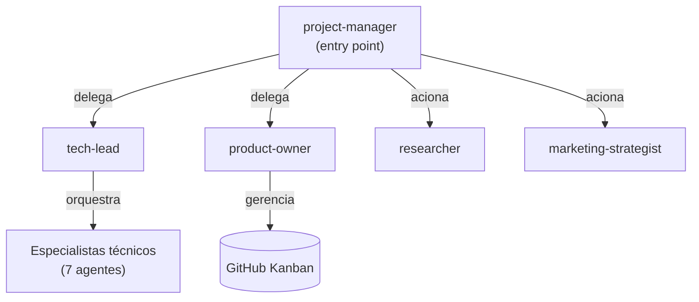

# Agentes — Visão geral

O sistema tem 12 agentes especializados, organizados em três níveis hierárquicos.

---

## Hierarquia

---

## Os 12 agentes

### Coordenação (3)

| Agente | Papel resumido |
|---|---|
| `project-manager` | Ponto de entrada — delega, consolida, nunca executa |
| `tech-lead` | Orquestrador técnico — revisa código, aprova PRs, orquestra especialistas |
| `product-owner` | Kanban e backlog — prioriza, fecha issues, mantém 6 dimensões |

### Inteligência e mercado (2)

| Agente | Papel resumido |
|---|---|
| `researcher` | Pesquisa de mercado, benchmarks, inteligência competitiva |
| `marketing-strategist` | Go-to-market, posicionamento, campanhas |

### Especialistas técnicos (7)

| Agente | Papel resumido |
|---|---|
| `data-engineer` | Pipelines, ETL, qualidade de dados |
| `ml-engineer` | Modelos, features, experimentos |
| `ai-engineer` | LLMs, agentes, RAG, evals |
| `infra-devops` | Cloud, CI/CD, containers, observabilidade |
| `qa` | Testes, cobertura, qualidade |
| `security-auditor` | Segurança, vulnerabilidades, OWASP |
| `frontend-engineer` | Web, UI/UX, acessibilidade |

---

## Regra fundamental

**Nenhum agente faz o trabalho de outro.**

- O project-manager não escreve código
- Os especialistas não fazem merge do próprio trabalho
- O tech-lead não toma decisões de produto
- O product-owner não implementa features

Esta separação garante que cada entregável passe por revisão independente antes de ser aceito.
