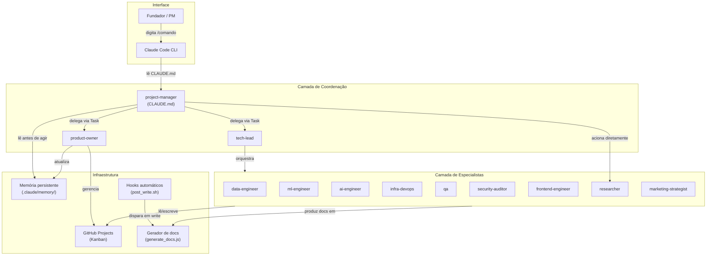

# Arquitetura — Visão geral

O template é organizado em quatro camadas que se comunicam de forma ordenada.

---

## Diagrama de camadas

---

## As quatro camadas

### 1. Interface

O usuário interage exclusivamente com o **Claude Code CLI** via texto. Os `/commands` são atalhos para fluxos de trabalho pré-definidos. Fora de um command, o `project-manager` responde como um assistente normal.

### 2. Coordenação

Três agentes controlam o fluxo de trabalho:

| Agente | Papel |
|---|---|
| `project-manager` | Ponto de entrada. Lê o Kanban, delega ao TL ou PO, consolida resultados. **Nunca executa trabalho técnico.** |
| `tech-lead` | Orquestrador técnico. Revisa PRs, faz merge, delega aos especialistas de engenharia. |
| `product-owner` | Dono do backlog. Gerencia o Kanban, prioriza issues, fecha cards concluídos. |

### 3. Especialistas

9 agentes temáticos. Cada um:

- Lê a issue antes de agir
- Move o card para "In Progress" no Kanban
- Produz o entregável (código, documento ou análise)
- Commita e notifica o TL ou PM para revisão
- **Nunca faz merge do próprio trabalho**

### 4. Infraestrutura

| Componente | Função |
|---|---|
| GitHub Projects | Kanban — fonte de verdade do estado do projeto |
| `.claude/memory/` | Memória persistente entre sessões (perfil, história, decisões) |
| `post_write.sh` | Hook pós-escrita: formata Python, gera PDF/DOCX, valida nomes |
| `generate_docs.js` | Converte `.md` em PDF/DOCX/PPTX para compartilhamento |

---

## Princípios de design

1. **Kanban como árbitro** — nenhum agente age sem consultar o board; nenhum entregável existe sem issue
2. **Especialização estrita** — cada agente tem papel único; nenhum faz o trabalho de outro
3. **Rastreabilidade total** — commits referenciam issues; PRs têm contexto; memória registra decisões
4. **Sem sobrescrita** — versões anteriores vão para `archive/`; o corrente fica visível em `ls`
5. **Separação system/produto** — mudanças em `.claude/` seguem regras de código (branch + PR + review)
