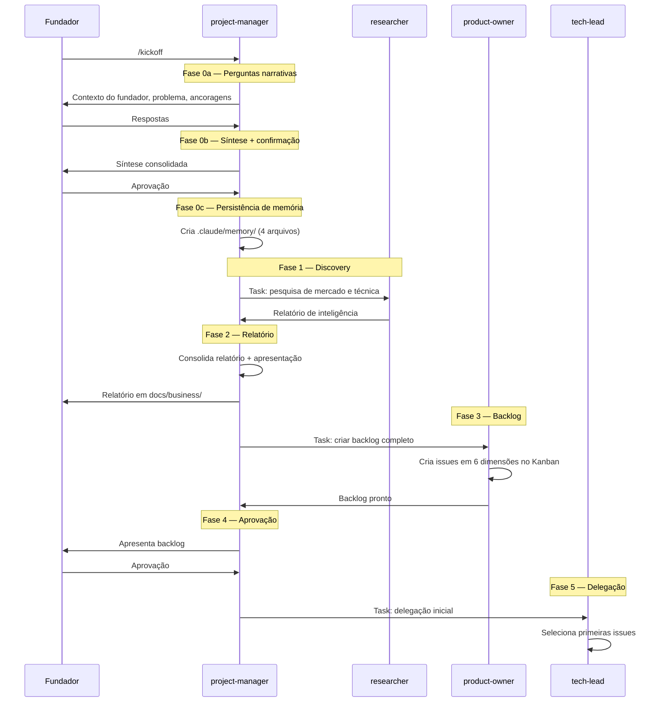

# Discovery — /kickoff

O kickoff é o ponto de partida de qualquer projeto. Ele conduz o discovery completo e monta o backlog antes de qualquer execução.

---

## Quando usar

- Ao iniciar um projeto novo (logo após o `/wizard`)
- Ao retomar um projeto que perdeu direção
- Ao pivotar e redefinir o escopo

---

## Fases do kickoff



---

## Fase 0 — Memória persistente

A Fase 0 é a mais importante. Ela cria a **memória do projeto** que persiste entre todas as sessões futuras.

### 0a — Perguntas narrativas

O PM faz perguntas abertas ao fundador:

1. Quem você é? (background, motivação, estilo de trabalho)
2. Qual problema este projeto resolve?
3. Para quem resolve? (ICP)
4. O que este projeto definitivamente **não** é?
5. Quais são suas ancoragens não-negociáveis?

### 0b — Síntese e confirmação

O PM consolida as respostas em uma síntese e pede confirmação antes de persistir.

### 0c — Persistência

Cria `.claude/memory/` com 4 arquivos:

```
.claude/memory/
├── MEMORY.md          # índice
├── user_profile.md    # quem é o fundador
├── project_genesis.md # gênese e ancoragens
└── project_history.md # histórico (vazio no início)
```

---

## Backlog em 6 dimensões

O product-owner cria issues cobrindo todas as dimensões do projeto:

| Dimensão | Exemplos de épicos |
|---|---|
| **Discovery** | Validação de problema, entrevistas com usuários |
| **Negócio** | Modelo de receita, pitch, parcerias |
| **Produto** | MVP, UX, roadmap de features |
| **Tech** | Arquitetura, stack, pipelines de dados |
| **Lançamento** | GTM, comunicação, canais |
| **Operações** | Monitoramento, suporte, processos internos |

---

## Resultado do kickoff

Ao final do kickoff:

- Memória persistente criada em `.claude/memory/`
- Relatório de discovery em `docs/business/relatorio_YYYY-MM-DD_v1.md`
- Backlog completo no GitHub Projects (issues em todas as 6 dimensões)
- Branch `dev` criado e configurado
- Primeiras issues delegadas ao TL para execução
