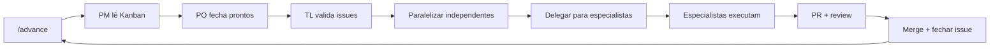
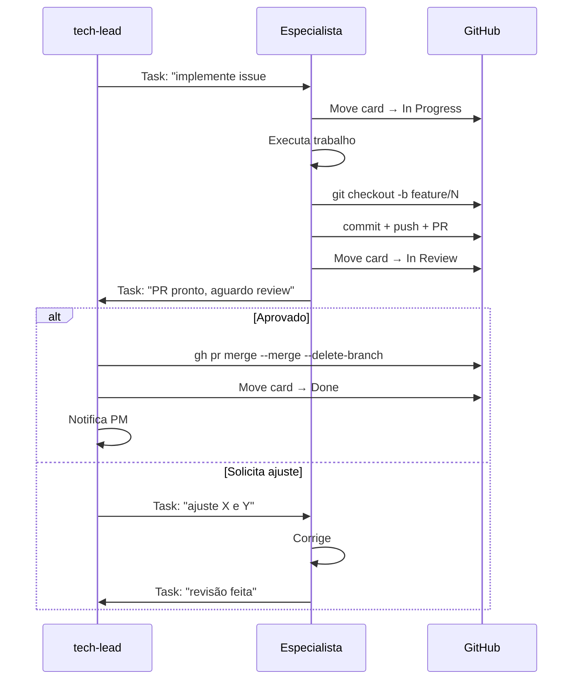

# Execução — regime recorrente

Após o kickoff, o projeto entra no regime de execução. O ciclo principal é baseado no `/advance`.

---

## O ciclo de execução

---

## /advance — passo a passo

1. **PM lê o Kanban** — identifica cards Done (sem issue fechada), In Review, In Progress, Todo
2. **PO fecha prontos** — valida entregáveis Done e fecha as issues correspondentes
3. **TL valida próximas** — confirma que issues Todo têm critérios claros e dependências resolvidas
4. **PM paraleliza** — identifica issues independentes e delega em paralelo via Agent Teams
5. **Especialistas executam** — cada agente move seu card, executa e abre PR
6. **TL revisa PRs** — code review, feedback, merge com `--merge --delete-branch`
7. **PO fecha issue** — após merge, move card para Done e fecha issue

---

## /review-backlog — varredura proativa

Use quando:
- O board está desatualizado
- Fim de fase ou sprint
- Antes de apresentação para stakeholders

O PO percorre todas as issues abertas, identifica:
- Issues prontas sem fechar
- Issues bloqueadas sem nota
- Lacunas no backlog (dimensões sem cobertura)
- Duplicatas ou issues obsoletas

---

## Comandos do regime de execução

| Command | Quando usar |
|---|---|
| `/advance` | Avançar o Kanban — fechamento + delegação + execução |
| `/review-backlog` | Varredura proativa do board |
| `/review` | Code review pontual de PR |
| `/deploy` | Deploy para produção com checklist |
| `/fix-issue` | Corrigir bug específico |
| `/clean` | Commitar e fazer push de tudo pendente |
| `/update-memory` | Registrar decisões importantes na memória |

---

## Fluxo de um entregável técnico

