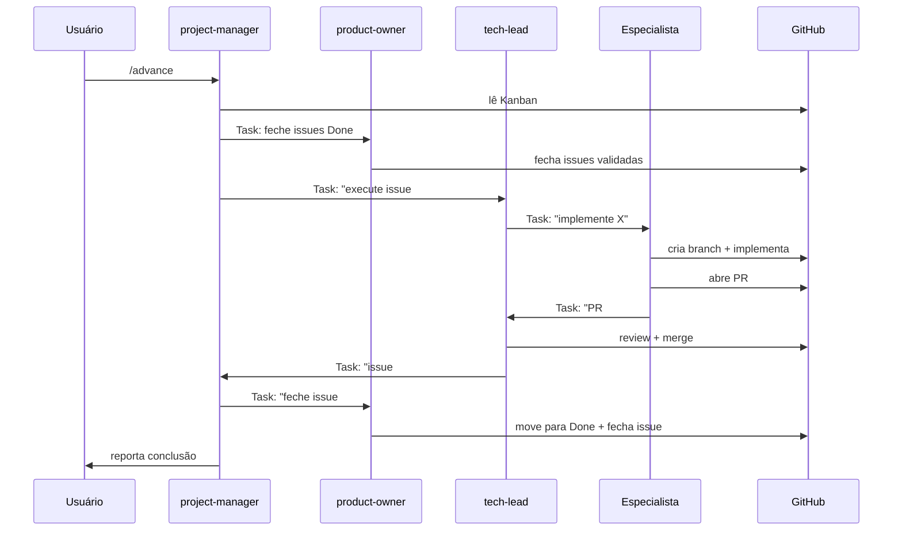

# Interações entre agentes

Como os agentes se comunicam, colaboram e transferem trabalho.

---

## Matriz de interações

| Agente | Responde a | Trabalha com |
|---|---|---|
| `project-manager` | Usuário | tech-lead, product-owner, researcher, marketing-strategist |
| `tech-lead` | project-manager | data-engineer, ml-engineer, ai-engineer, infra-devops, qa, security-auditor, frontend-engineer, researcher |
| `product-owner` | project-manager | researcher, marketing-strategist, Kanban |
| `researcher` | PM / PO / TL | todos que precisam de inteligência |
| `marketing-strategist` | PM / PO | researcher |
| `data-engineer` | tech-lead | researcher, qa |
| `ml-engineer` | tech-lead | data-engineer, researcher |
| `ai-engineer` | tech-lead | researcher, ml-engineer |
| `infra-devops` | tech-lead | security-auditor |
| `frontend-engineer` | tech-lead | infra-devops, researcher |
| `qa` | tech-lead | data-engineer, ml-engineer |
| `security-auditor` | tech-lead / infra-devops | infra-devops |

---

## Fluxo de uma feature completa

---

## Regras de comunicação

1. **Task para especialistas** — sempre via `Task()` com contexto completo (issue número, critérios, branch a usar)
2. **Resposta ao PM** — especialistas reportam ao TL ou PM via `Task` ao concluir
3. **Sem comunicação lateral** — especialistas não falam entre si diretamente (passam pelo TL)
4. **Kanban como estado compartilhado** — todos leem o board antes de agir

---

## Conflitos e escalation

| Situação | Resolução |
|---|---|
| Dois agentes querem modificar o mesmo arquivo | TL decide a ordem |
| Especialista encontra bloqueio técnico | Reporta ao TL com opções |
| Decisão de produto necessária | TL escala para PM → usuário |
| Vulnerabilidade de segurança | security-auditor reporta ao TL → PM → usuário |
